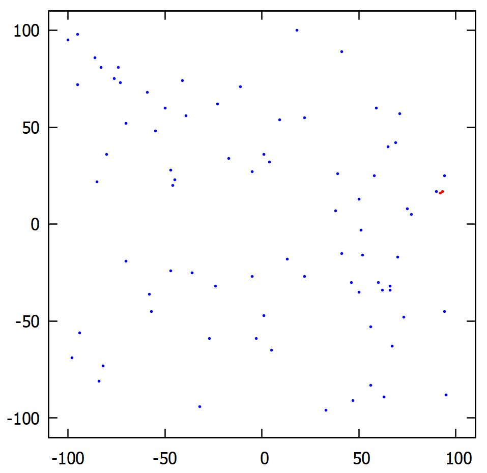
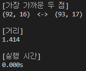
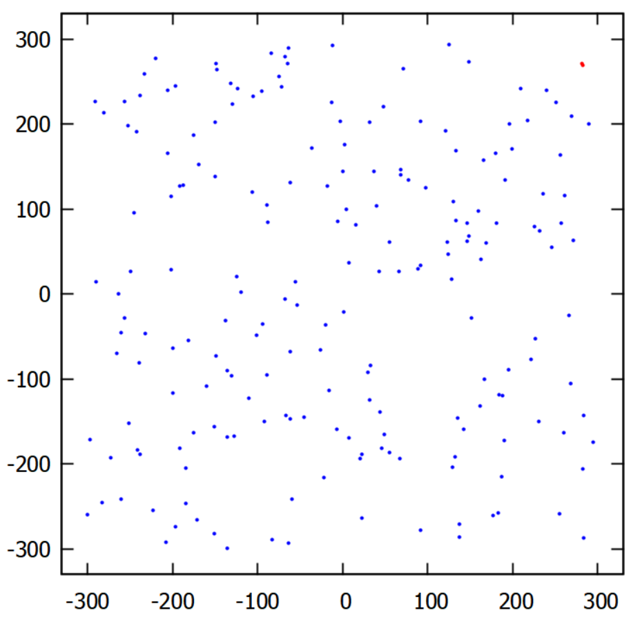
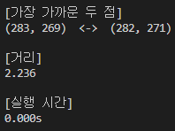
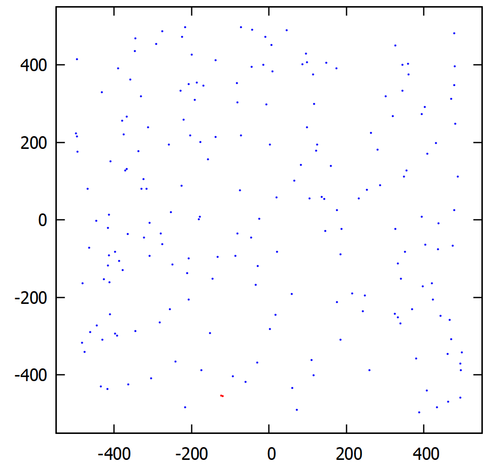
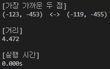
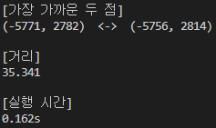
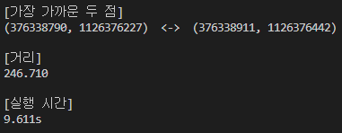

# **실행 결과 데이터**

* x : -100 ~ 100
* y : -100 ~ 100
* 점의 개수 : 80개

---

* x : -300 ~ 300
* y : -300 ~ 300
* 점의 개수 : 200개

---

* x : -500 ~ 500
* y : -500 ~ 500
* 점의 개수 : 200개

---

* x : -10,000 ~ 10,000
* y : -10,000 ~ 10,000
* 점의 개수 : 100,000개

---

* x : 0 ~ 2,000,000,000
* y : 0 ~ 2,000,000,000
* 점의 개수 : 3,000,000개

---