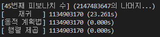
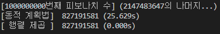

# **피보나치 수 구하기**

피보나치수를 구하는 방법으로 3가지를 구현해 보았다.

### **1. 재귀**

재귀를 이용하여 피보나치 수를 구현하면 $O(2^N)$의 시간복잡도로 $n$번째 피보나치 수를 구할 수 있다.

### **2. DP**

dp를 이용하여 피보나치 수를 구현하면, 배열을 순회하면서 $O(N)$의 시간복잡도로 $n$번째 피보나치 수를 구할 수 있다.

* **[bottom_up]**

    tabulation을 사용하는 방법으로 구현한 코드의 방식이다.

* **[top_down]**

    메모이제이션을 이용하는 방법으로 다음과 같이 구현 가능하다.

    ``` c
    int dp[n+1] = {0, };
    int fibonacci(int n) {
        if (n <= 1) return n;

        if (dp[n] != 0) return dp[n];
        else return dp[n] = fibonacci(n-1) + fibonacci(n-2);
    }
    ```

### **3. 분할정복을 이용한 행렬 곱셈**
피보나치 수의 점화식은 $F_{n+1} = F_n + F_{n-1}$ 인데, 이를 행렬로 나타내면 다음과 같다.

$$
\begin{pmatrix} F_{n+1} \\\\ F_n \end{pmatrix}\ =\ 
\begin{pmatrix} 1&1\\\\1&0 \end{pmatrix} \begin{pmatrix} F_n \\\\ F_{n-1} \end{pmatrix}
\ \ \ \ \ \ , \ \ \ \ \ \ 
\begin{pmatrix} F_n \\\\ F_{n-1} \end{pmatrix}\ =\ 
\begin{pmatrix} 1&1\\\\1&0 \end{pmatrix} \begin{pmatrix} F_{n-1} \\\\ F_{n-2} \end{pmatrix}
$$

여기서 위의 두식을 대입하여 차수를 줄여가면 다음과 같다.

$$
\begin{pmatrix} F_{n+1} \\\\ F_n \end{pmatrix}\ =\ 
\begin{pmatrix} 1&1\\\\1&0 \end{pmatrix} \begin{pmatrix} F_n \\\\ F_{n-1} \end{pmatrix}\ =\ 
\begin{pmatrix} 1&1\\\\1&0 \end{pmatrix}^2 \begin{pmatrix} F_{n-1} \\\\ F_{n-2} \end{pmatrix}\ =\ 
... 
\ =\ 
\begin{pmatrix} 1&1\\\\1&0 \end{pmatrix}^n \begin{pmatrix} F_1 \\\\ F_0 \end{pmatrix}\ =\ 
\begin{pmatrix} 1&1\\\\1&0 \end{pmatrix}^n \begin{pmatrix} 1 \\\\ 0 \end{pmatrix}
$$

여기서 행렬의 거듭제곱은 분할 탐색을 이용하면 $O(log_2N)$의 시간복잡도로 구할 수 있으므로, 결론적으로 $O(log_2N)$의 시간복잡도로 피보나치 수를 구할 수 있다.

---
## **시간복잡도 정리**

| 재귀 | 동적 계획법 | 분할정복을 이용한 행렬 제곱 |
|:------:|:--------:|:-------------------------:|
|$O(2^N)$|   $O(N)$ |       $O(log_2N)$         |


---
## 결과 1

이 실행결과에서 볼 수 있듯이, 45번째 피보나치 수를 구할 때 재귀의 경우 $O(2^{45}) \approx O(3\times10^{13})$ 으로 매우 큰 실행 횟수가 나오므로 많은 시간이 걸렸지만, 선형이나 log스케일의 경우는 0.001초 미만의 속도가 걸린다.

 

---

## 결과 2

$ n = 10^{9}$ 일때 재귀의 경우는 매우 큰 시간이 걸리므로 제외하고, dp와 분할정복을 비교하면 dp의 경우는 $O(N)$이므로 큰 시간이 걸리지만, 분할정복은 $O(log_2N)$으로 매우 적은 시간으로 계산할 수 있었다.


