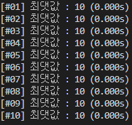

# **증가하다가 감소하는 수열에서의 최댓값**

단순히 선형탐색을 하면서 최댓값을 찾으면 시간복잡도가 $O(N)$이므로, $O(lgN)$의 시간복잡도를 가지려면 다른 접근이 필요하다.

주어진 수열이 증가하다가 감소하는 수열, 즉 바이토닉 수열이기때문에, 이 성질을 이용하여 이분탐색을 적용하면 우리가 찾고자하는 최댓값인 극댓값을 찾을 수 있다.

---

## **알고리즘 설명**

바이토닉 수열을 살펴보면 증가하는 부분($a_{i-1} < a_i < a_{i+1}$), 감소하는 부분($a_{i-1} < a_i < a_{i+1}$), 최댓값인 부분($a_{i-1} < a_i\ \ and\ \ a_i < a_{i+1}$)으로 나눌 수 있다.
그리고 바이토닉 수열의 정의에 의해 증가하다가 최댓값이 나오고 감소하게 된다. 이를 이용하여 이분탐색을 진행하면 답을 구할 수 있다.

1. **가운데 값이 증가하는 부분일 때**

    이 경우에서 우리가 찾고자하는 최댓값이 가운데를 기준으로 우측에 있기 때문에, 가운데로 나뉜 부분의 오른쪽에서 탐색을 계속 하면 된다.

2. **가운데 값이 감소하는 부분일 때**

    이 경우에서는 우리가 찾고자하는 최댓값이 좌측에 있기 때문에, 가운데의 왼쪽 부분에서 탐색을 계속 하면 된다.

3. **가운데 값이 최댓값일 때**

    이 경우는 우리가 찾고자하는 부분이므로, 그냥 이 값을 반환하고 탐색을 마치면 된다.

찾고자하는 부분의 가운데 값의 정보를 바탕으로 부분을 절반으로 줄여가면서 탐색하기 때문에 시간복잡도는 $O(log_2N)$이 된다.

---

## **실제 테스트**

```python
import random as rd
f = open("input.txt", "w")
t, n = 10, 10
f.write(f'{t} {n}\n')
for _ in range(t) :
    left = sorted(rd.sample(list(range(1, n)), rd.randint(1, n-2)))
    right = sorted([x for x in range(1, n) if left.count(x) == 0], reverse=True)
    f.write(' '.join([str(x) for x in left + [n] + right])+'\n')
f.close()
```
위와 같은 파이썬 코드를 통하여 바이토닉 수열을 만들었고, 이를 통해 구현한 알고리즘을 확인해보았다.

<br>

```
[테스트에 사용된 바이토닉 수열들]
#01. 2 9 10 8 7 6 5 4 3 1
#02. 1 2 3 5 7 8 9 10 6 4
#03. 2 3 4 5 6 8 9 10 7 1
#04. 2 3 4 7 8 10 9 6 5 1
#05. 1 2 4 7 9 10 8 6 5 3
#06. 5 7 10 9 8 6 4 3 2 1
#07. 3 5 7 10 9 8 6 4 2 1
#08. 2 4 6 10 9 8 7 5 3 1
#09. 3 4 5 6 7 8 9 10 2 1
#10. 2 3 4 7 9 10 8 6 5 1
```



다음과 같이 문제없이 최댓값을 구하고 있다.