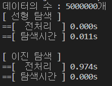
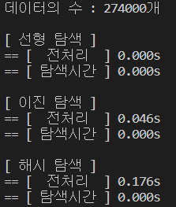

# 프로그램 실행 결과 분석

이 프로그램을 통해 아래의 3가지 탐색 방법을 직접 구현하고, 실행시간을 비교해 보았다.

1. 선형 탐색

    선형 탐색의 경우 별다른 전처리가 필요없이 배열을 돌면서 target값이 있는지 확인해주면 되기 때문에, 시간복잡도는 O(n)이다.

2. 이진 탐색

    이진 탐색의 경우 탐색하기전 정렬을 해주어야하기 때문에, 정렬을 하는 시간 O(nlgn)이 든다. 그후 탐색을 진행하면 O(lgn)이라는 시간이 추가로 든다.

3. 해시 탐색

    해시 탐색을 위해서 수들을 해시 테이블에 넣어야 하는데, 데이터의 양이 많아지면 그에 따라 해시테이블의 크기도 현저히 커지는 문제가 있다. 따라서 많은 양의 데이터에서 직접 테스트하는것은 무리가 있었다.
    해시 탐색의 시간 복잡도는 O(1)이다.

---
## 결과 1

이진 탐색이 O(lgn)이기 때문에 선형 탐색에 비해 압도적인 시간을 보였지만, 이진탐색을 위해서는 배열을 정렬해야하기 때문에, 다음과 같이 전처리 시간이 1초가 걸렸다.

---
## 결과 2

적은 데이터에서의 실험 결과, 해시 테이블을 생성하는 시간이 다른 탐색에 비해 컸다. 따라서 해시 탐색을 다른 탐색들과 비교하기에는 무리가 있다.

